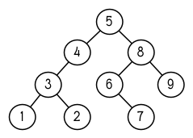

.. highlight:: cl
   :linenothreshold: 0

第四章：特殊数据结构
***************************************************

在之前的章节里，我们讨论了列表，Lisp 最多功能的数据结构。本章将演示如何使用 Lisp 其它的数据结构：数组（包含向量与字串），结构以及哈希表。它们或许不像列表这么灵活，但他们可以存取速度更快并使用更少空间。

Common Lisp 还有另一种数据结构：实例（instance）。实例将在 11 章讨论，讲述 CLOS。

4.1 数组 (Array)
===================

在 Common Lisp 里，你可以调用 ``make-array`` 来构造一个数组，第一个实参为一个指定数组维度的列表。要构造一个 ``2 x 3`` 的数组，我们可以：

::

  > (setf arr (make-array '(2 3) :initial-element nil))
  #<Simple-Array T (2 3) BFC4FE>

Common Lisp 的数组至少可以有七个维度，每个维度至少可以有 1023 个元素。

``:initial-element`` 实参是选择性的。如果有提供这个实参，整个数组会用这个值作为初始值。若试著取出未初始化的数组内的元素，其结果为未定义（undefined）。

用 ``aref`` 取出数组内的元素。与 Common Lisp 的存取函数一样， ``aref`` 是零索引的（zero-indexed）：

::

  > (aref arr 0 0)
  NIL

要替换数组的某个元素，我们使用 ``setf`` 与 ``aref`` ：

::

  > (setf (aref arr 0 0) 'b)
  B
  > (aref arr 0 0)
  B

要表示字面常量的数组（literal array），使用 ``#na`` 语法，其中 ``n`` 是数组的维度。举例来说，我们可以这样表示 ``arr`` 这个数组：

::

  #2a((b nil nil) (nil nil nil))

如果全局变量 ``*print-array*`` 为真，则数组会用以下形式来显示：

::

  > (setf *print-array* t)
  T
  > arr
  #2A((B NIL NIL) (NIL NIL NIL))

如果我们只想要一维的数组，你可以给 ``make-array`` 第一个实参传一个整数，而不是一个列表：

::

  > (setf vec (make-array 4 :initial-elment nil))
  #(NIL NIL NIL NIL)

一维数组又称为向量（\ *vector*\ ）。你可以通过调用 ``vector`` 来一步骤构造及填满向量，向量的元素可以是任何类型：

::

  > (vector "a" 'b 3)
  #("a" b 3)

字面常量的数组可以表示成 ``#na`` ，字面常量的向量也可以用这种语法表达。

可以用 ``aref`` 来存取向量，但有一个更快的函数叫做 ``svref`` ，专门用来存取向量。

::

  > (svref vec 0)
  NIL

在 ``svref`` 内的 “sv” 代表“简单向量”（“simple vector”），所有的向量缺省是简单向量。 [1]_

4.2 示例：二叉搜索 (Example: Binary Search)
=============================================

作为一个示例，这小节演示如何写一个在排序好的向量里搜索一个对象的函数。如果我们知道一个向量是排序好的，我们可以比 ``find`` (65页）做的更好， ``find`` 必须依序检视每一个元素。取而代之的，我们跳到向量中间开始。如果中间的元素是我们要找的对象，搜索完毕。不然，我们持续往左半部或往右半部搜索，取决于​​对象是小于或大于中间的元素。

图 4.1 包含了一个这样工作的函数。其实这两个函数： ``bin-search`` 设置初始范围及发送控制信号给 ``finder`` ，它寻找向量 ``vec`` 内 ``obj`` 是否介于 ``start`` 及 ``end`` 之间。

::

  (defun bin-search (obj vec)
    (let ((len (length vec)))
      (and (not (zerop len))
           (finder obj vec 0 (- len 1)))))

  (defun finder (obj vec start end)
    (let ((range (- end start)))
      (if (zerop range)
          (if (eql obj (aref vec start))
              obj
              nil)
          (let ((mid (+ start (round (/ range 2)))))
            (let ((obj2 (aref vec mid)))
              (if (< obj obj2)
                  (finder obj vec start (- mid 1))
                  (if (> obj obj2)
                      (finder obj vec (+ mid 1) end)
                      obj)))))))

图 4.1: 搜索一个排序好的向量

**勘误:** 图 4.1 的 ``bin-search`` 函数，如果你给一个比向量 ``vec`` 中最小元素还小的元素，会出错。

如果要找的 ``range`` 缩小至一个元素，而如果这个元素是 ``obj`` 的话，则 ``finder`` 返回这个元素，反之返回 ``nil`` 。如果 ``range`` 包含了数个元素，我们設置 ``middle`` ( ``round`` 返回离参数最近的整数) 為 ``obj2`` 。如果 ``obj`` 小于 ``obj2`` ，则继续递归地往向量的左半部寻找。如果 ``obj`` 大于 ``obj2`` ，则继续递回地往向量的右半部寻找。剩下的一个选择是 ``obj=obj2`` ，这个情况我们找到要找的元素，直接返回这个元素。

如果我们插入下面这行至 ``finder`` 的起始处：

::

  (format t "~A~%" (subseq vec start (+ end 1)))

我们可以观察被搜索的元素的数量是每一步往左减半的：

::

  > (bin-search 3 #(0 1 2 3 4 5 6 7 8 9))
  #(0 1 2 3 4 5 6 7 8 9)
  #(0 1 2 3)
  #(3)
  3

4.3 字符与字串 (Strings and Characters)
=============================================

字串是字符向量。我们用一系列由双引号包住的字符来表示一个字串常量，一个字符 ``c`` 用 ``#\c`` 表示。

每个字符都有一个相关的整数 –– 通常是用 ASCII 码，但不一定是。在多数的 Lisp 实现里，函数 ``char-code`` 返回与字符相关的数字，而 ``code-char`` 返回与数字相关的字符。

字符比较函数 ``char<`` (小于)， ``char<=`` (小于等于)， ``char=`` (等于)， ``char>=`` (大于等于) ， ``char>`` (大于)，以及 ``char/=`` (不同)。他们的工作方式和 146 页(译注 9.3 节)的数字比较操作符一样。

::

  > (sort "elbow" #'char<)
  "below"

因为字串是向量，序列与数组的函数都可以给字串使用。你可以使用 ``aref`` 来取出元素，举例来说，

::

  > (aref "abc" 1)
  #\b

但对一个字串，你可以使用更快的 ``char`` 函数：

::

  > (char "abc" 1)
  #\b

你可以使用 ``setf`` 搭配 ``char`` (或 ``aref`` )来替换元素：

::

  > (let ((str (copy-seq "Merlin")))
     (setf (char str 3) #\k)
     str)

如果你想要比较两个字串，你可以使用通用的 ``equal`` 函数，但还有一个忽略大小写的比较函数 ``string-equal`` ：

::

  > (equal "fred "fred")
  T
  > (equal "fred" "Fred")
  NIL
  >(string-equal "fred" "Fred")
  T

Common Lisp 提供大量的操控及比较字串的函数。他们收录在附录D，从 364 页开始。

有很多种方式可以创造一个字串。最普遍的方式是使用 ``format`` 。将第一个参数设为 ``nil`` 来调用 ``format`` ，使它返回一个它本来会印出来的字串：

::

  > (format nil "~A or ~A" "truth" "dare")
  "truth or dare"

但若你只想把数个字串连结起来，你可以使用 ``concatenate`` ，它接受一个指定類型的符号，加上一个或多个序列：

::

  > (concatenate 'string "not " "to worry")
  "not to worry"

4.4 序列 (Sequences)
===========================

在 Common Lisp 里，序列类型包含了列表与向量（因此也包含了字串）。有些我们在列表上使用的函数，其实是序列函数，包括 ``remove`` , ``length`` , ``subseq`` , ``reverse`` , ``sort`` , ``every`` 以及 ``some`` 。所以 46 页（译注 3.11 小节的 ``mirror?`` 函数）我们所写的函数，也可以用在别种序列上：

::

  > (mirror? "abba")
  T

我们已经看过四个用来取出序列元素的函数： 给列表使用的 ``nth`` ， 给向量使用的 ``aref`` 及 ``svref`` ，以及给字串使用的 ``char`` 。 Common Lisp 也提供了函数 ``elt`` ，对任何种类的序列都有效：

::

  > (elt '(a b c) 1)
  B

针对特定类型的序列，我们已经见过的存取函数应当比较快，所以使用 ``elt`` 是没有意义的，除非在代码中，有要通用地支援序列的地方。

使用 ``elt`` ，我们可以写一个对向量来说更有效率的 ``mirror?`` 版本：

::

  (defun mirror? (s)
    (let ((len (length s)))
      (and (evenp len)
           (do ((forward 0 (+ forward 1))
                (back (- len 1) (- back 1)))
               ((or (> forward back)
                    (not (eql (elt s forward)
                              (elt s back))))
                (> forward back))))))

这个版本也可以给列表使用，但这个实现更适合给向量使用。频繁的对列表调用 ``elt`` 的代价是昂贵的，因为列表仅允许循序存取。而向量允许随机存取，从任何元素来存取每一个元素都是廉价的(cheap)。

许多序列函数接受一个或多个，从这个表格所列出的标准关键字参数：

+-----------+----------------------+-----------+
| 参数      | 用途                 | 缺省值    |
+===========+======================+===========+
| :key      | 应用至每个元素的函数 | identity  |
+-----------+----------------------+-----------+
| :test     | 作来比较的函数       | eql       |
+-----------+----------------------+-----------+
| :from-end | 若为真，反向工作。   | nil       |
+-----------+----------------------+-----------+
| :start    | 起始位置             | 0         |
+-----------+----------------------+-----------+
| :end      | 若有给定，结束位置。 | nil       |
+-----------+----------------------+-----------+

一个接受全部关键字参数的函数是 ``position`` ，它返回序列中一个元素的位置，而未找到时，返回 ``nil`` 。我们使用 ``position`` 来演示关键字参数所扮演的角色。

::

  > (position #\a "fantasia")
  1
  > (position #\a "fantasia" :start 3 :end 5)
  4

第二个例子我们要找在第四个与第六个字符间，第一个 ``a`` ​​所出现的位置。 ``:start`` 关键字参数是第一个被考虑的元素位置，缺省是序列的第一个元素。 ``:end`` 关键字参数，如果有给的话，是第一个不被考虑的元素位置。

如果我们给入 ``:from-end`` 关键字参数，

::

  > (position #\a "fantasia" :from-end t)
  7

我们得到最靠近结尾的 ``a`` ​​的位置。但位置是用平常的方式计算；它不代表从结尾算回来的距离。

``:key`` 关键字参数是序列中每个元素在被考虑前，应用至元素的函数。如果我们询问像是这样的东西，

::

  > (position 'a '((c d) (a b)) :key #'car)
  1

那么我们要找的是元素的 ``car`` 部分是符号 ``a`` ​​的第一个元素。

``:test`` 关键字参数是一个有两个参数的函数，并定义了怎样是一个成功的匹配。它的缺省函数为 ``eql`` 。如果你想要匹配一个列表，你也许想使用 ``equal`` 来取代：

::

  > (position '(a b) '((a b) (c d)))
  NIL
  > (position '(a b) '((a b) (c d)) :test #'equal)
  0

``:test`` 关键字参数可以是任何接受两个参数的函数。举例来说，给定 ``<`` ，我们可以询问第一个使第一个参数比它小的元素位置：

::

  > (position 3 '(1 0 7 5) :test #'<)
  2

使用 ``subseq`` 与 ``position`` ，我们可以写出分开序列的函数。举例来说，这个函数

::

  (defun second-word (str)
    (let ((p1 (+ (position #\ str) 1)))
      (subseq str p1 (position #\ str :start p1))))

返回字串中用空格隔开的第二个单字：

::

  > (second-word "Form follows function")
  "follows"

要找到满足接受一个参数的判断式的一个元素，我们使用 ``position-if`` 。它接受一个函数与一个序列，并返回第一个满足此函数的第一个元素：

::

  > (position-if #'oddp '(2 3 4 5))
  1

它接受除了 ``:test`` 之外的所有关键字参数。

有许多相似的函数，如给序列使用的 ``member`` 与 ``member-if`` 。它们分别是， ``find`` （接受全部关键字参数）与 ``find-if`` （接受除了 ``:test`` 之外的所有关键字参数）：

::

  > (find #\a "cat")
  #\a

  > (find-if #'characterp "ham")
  #\h

不像是 ``member`` 与 ``member-if`` ，它们仅返回要寻找的对象。

通常一个 ``find-if`` 的调用，如果解读为 ``find`` 搭配一个 ``:key`` 关键字参数的话，会显得更清楚。举例来说，表达式

::

  (find-if #'(lambda (x)
               (eql (car x) 'complete))
           lst)

可以更好的解读为

::

  (find 'complete lst :key #'car)

函数 ``remove`` ( 22 页)以及 ``remove-if`` 通常都可以用在序列。它们跟 ``find`` 与 ``find-if`` 是一样的关系。一个相关的函数是 ``remove-duplicates`` ，它只保留序列中每个元素的最后一次出现。

::

  > (remove-duplicates "abracadabra")
  "cdbra"

这个函数接受前表所列的所有关键字参数。

函数 ``reduce`` 用来把一个序列压缩成一个值。它接受至少两个参数，一个函数与一个序列。这函数必须是一个接受两个参数的函数。在最简单的情况下，函数起初用前两个元素作为参数来调用，之后接续的元素作为下次调用的第二个参数，而上次返回的值作为下次调用的第一个参数。最后调用所返回的值作为 ``reduce`` 函数的返回值。也就是说像是这样的表达式：

::

  (reduce #'fn '(a b c d))

等同于

::

  (fn (fn (fn 'a 'b) 'c) 'd)

我们可以使用 ``reduce`` 来扩充只接受两个参数的函数。举例来说，要得到三个或多个列表的交集(intersection)，我们可以：

::

  > (reduce #'intersection '((b r a d 's) (bad) (cat)))
  (A)

4.5 示例：解析日期 (Example: Parsing Dates)
=============================================

作为一个序列操作的例子，这小节演示了如何写一个程序来解析日期。我们将编写一个程序，可以接受一个像是 “16 Aug 1980” 的字串，然后返回一个表示日、月、年的整数列表。

::

  (defun tokens (str test start)
    (let ((p1 (position-if test str :start start)))
      (if p1
          (let ((p2 (position-if #'(lambda (c)
                                     (not (funcall test c)))
                                 str :start p1)))
            (cons (subseq str p1 p2)
                  (if p2
                      (tokens str test p2)
                      nil)))
          nil)))

  (defun constituent (c)
    (and (graphic-char-p c)
         (not (char= c #\ ))))

图 4.2 辨别符号 (token)

图 4.2 中包含了某些我们在这应用里所需的通用解析函数。第一个， ``tokens`` ，用来从字串中取出符号 (token)。给定一个字串及一个测试函数，它返回一个字符满足此函数的子字串的列表。举例来说，如果测试函数是对字母返回真的 ``alpha-char-p`` 函数，我们得到：

::

  > (tokens "ab12 3cde.f" #'alpha-char-p 0)
  ("ab" "cde" "f")

所有不满足此函数的字符被视为空白 –– 他们使符号 (token)分开，但永远不是符号 (token)的一部分。

函数 ``constituent`` 被定义成用来作为 ``tokens`` 的参数。

在 Common Lisp 里， *图形字符* 是我们可见的字符，加上空白字符。所以如果我们用 ``constituent`` 作为测试函数时，

::

  > (tokens "ab12 3cde.f gh" #'constituent 0)
  ("ab12" "3cde.f" "gh")

则符号 (tokens)将会有一般常见的空白概念。

图 4.3 包含了特别为解析日期用的函数。这函数 ``parse-date`` 接受一个特别形式的日期，并返回一个代表其组成的整数列表：

::

  > (parse-date "16 Aug 1980")
  (16 8 1980)

::

  (defun parse-date (str)
    (let ((toks (tokens str #'constituent 0)))
      (list (parse-integer (first toks))
            (parse-month (second toks))
            (parse-integer (third toks)))))

  (defconstant month-names
    #("jan" "feb" "mar" "apr" "may" "jun"
      "jul" "aug" "sep" "oct" "nov" "dec"))

  (defun parse-month (str)
    (let ((p (position str month-names
                           :test #'string-equal)))
      (if p
          (+ p 1)
          nil)))

图 4.3 解析日期的函数

它使用 ``tokens`` 来解开一个日期字串，然后调用 ``parse-month`` 及 ``parse-integer`` 来解译这些元素。要找到月份，它调用 ``parse-month`` ，由于使用的是 ``string-equal`` 来匹配月份的名字，所以输入可以不分大小写。要找到年和日，它调用内建的 ``parse-integer`` ， ``parse-integer`` 接受一个字串并返回对应的整数。

如果我们需要写程序来解析整数，我们也许可以：

::

  (defun read-integer (str)
    (if (every #'digit-char-p str)
        (let ((accum 0))
          (dotimes (pos (length str))
            (setf accum (+ (* accum 10)
                           (digit-char-p (char str pos)))))
          accum)
      nil))

这个定义演示了在 Common Lisp 中，字符是如何转成数字的 – 函数 ``digit-char-p`` 不仅测试一个字符是否为数字，也返回了对应的整数。

4.6 结构 (Structures)
===========================

结构可以想成是豪华版的向量。假设你要写一个程序来追踪很多长方体。你可能会想用三个向量元素来表示长方体：高度、宽度及深度。你的程序会变得更容易读，如果你与其使用原本的 ``svrefs`` ，而定义一个像是这样

::

  (defun block-height (b) (svref b 0))

等等的函数来取代。你可以把结构想成是，这些函数都替你定义好了的向量。

要定义一个结构，我们使用 ``defstruct`` 。在最简单的情况下，我们只要给出结构及字段的名字就可以了：

::

  (defstruct point
    x
    y)

这定义了一个 ``point`` 具有两个字段 ``x`` 与 ``y`` 。它也隐性地定义了 ``make-point`` , ``point-p`` , ``copy-point`` , ``point-x`` 及 ``point-y`` 函数。

2.3 节提到 Lisp 程序可以写 Lisp 程序。这是我们目前所看过的明显例子之一。当你调用 ``defstruct`` 时，它自动写好了其它几个函数的定义。有了宏，你将能够自己来办到同样的事情（如果你需要的话，你甚至可以自己写 ``defstruct`` ）。

每一个 ``make-point`` 的调用，会返回一个新的 ``point`` 。我们可以藉由给予对应的关键字参数，来指定单一字段的值：

::

  (setf p (make-point :x 0 :y 0))
  #S(POINT X 0 Y 0)

存取 ``point`` 字段的函数不仅被定义成可取出数值，也可以与 ``setf`` 合作使用。

::

  > (point-x p)
  0
  > (setf (point-y p) 2)
  2
  > p
  #S(POINT X 0 Y 2)

定义一个结构也定义了一个以此为名的类型。每个点会是类型 ``point`` ，然后是 ``structure`` ，接着是 ``atom`` ，最后是 ``t`` 。所以使用 ``point-p`` 来测试某个东西是不是一个点，也可以使用通用性的函数，像是 ``typep`` 来测试。

我们可以藉由在本来的定义中，附上一个含有字段名及一个预设表达式的列表，来指定结构字段的缺省值。

::

  (defstruct polemic
    (type (progn
            (format t "What kind of polemic was it? ")
            (read)))
    (effect nil))

如果 ``make-polemic`` 调用没有替这些字段指定初始值，他们会被设成对应表达式的值：

::

  > (make-polemic)
  What kind of polemic was it? scathing
  #S(POLEMIC TYPE SCATHING EFFECT NIL)

我们也可以控制结构显示的方式，以及结构产生的存取函数的字首。这里是一个更详细的做了这两件事的 ``point`` 定义：

::

  (defstruct (point (:conc-name p)
                    (:print-function print-point))
    (x 0)
    (y 0))

  (defun print-point (p stream depth)
    (format stream "#<~A, ~A>" (px p) (py p)))

``:conc-name`` 参数指定了要放在字段名前面的名字，并用这些名字来生成存取函数。预设是 ``point-`` ；现在变成只有 ``p`` 。不使用预设的方式，使你的代码的可读性降低了一点，所以你只有在会常常用到这些存取函数时，你才会想做这类的事情。

``:print-function`` 是在它需要被显示时，要用来打印的函数 *名* –– 比如，顶层要显示时。这个函数需要接受三个参数：要被印出的结构，在哪里被印出，第三个参数通常可以被忽略。 [2]_ 我们会在7.1 节讨论这些流(stream)。对现在来说，只要知道作为参数的流可以传给 ``format`` 就好了。

函数 ``print-point`` 会用缩写的形式来显示点：

::

  > (make-point)
  #<0,0>

4.7 示例：二叉搜索树 (Example: Binary Search Tree)
======================================================

因为 ``sort`` 本身是自带的，你会很少，如果有的话，需要在 Common Lisp 里编排序程序。本节演示如何解决一个相关的问题，这个问题尚未有现成的解决方案：维护一个已排序的对象集合。本节的代码会把对象存在二叉搜索树里（ *binary search tree* ）或称作 BST。当二叉搜索树平衡时，它允许我们可以在与时间成 ``log n`` 比例的时间内，来寻找、添加或是删除元素，其中 ``n`` 是集合的大小。

图 4.4: 二叉搜索树

一个二叉搜索树是一种二叉树，其中给定某个排序函数 ``<`` ，每个元素的左子树都 ``<`` 该元素，而该元素 ``<`` 其右子树。图 4.4 展示一个根据 ``<`` 排序的示例。

图 4.5 包含了二叉搜索树中，插入与寻找的函数。基本的数据结构会是 ``node`` （节点），它有三个字段：一个是存在该节点的对象，以及各一个字段，给节点的左子树及右子树。你可以把节点想成是有一个 ``car`` 和两个 ``cdr`` 的一个 cons 核（cons cell）。

::

  (defstruct (node (:print-function
                    (lambda (n s d)
                      (format s "#<~A>" (node-elt n)))))
    elt (l nil) (r nil))

  (defun bst-insert (obj bst <)
    (if (null bst)
        (make-node :elt obj)
        (let ((elt (node-elt bst)))
          (if (eql obj elt)
              bst
              (if (funcall < obj elt)
                  (make-node
                     :elt elt
                     :l (bst-insert obj (node-l bst) <)
                     :r (node-r bst))
                  (make-node
                     :elt elt
                     :r (bst-insert obj (node-r bst) <)
                     :l (node-l bst)))))))

  (defun bst-find (obj bst <)
    (if (null bst)
        nil
        (let ((elt (node-elt bst)))
          (if (eql obj elt)
              bst
              (if (funcall < obj elt)
                  (bst-find obj (node-l bst) <)
                  (bst-find obj (node-r bst) <))))))

  (defun bst-min (bst)
    (and bst
         (or (bst-min (node-l bst)) bst)))

  (defun bst-max (bst)
    (and bst
         (or (bst-max (node-r bst)) bst)))

图 4.5 二叉搜索树：查询与插入

一个二叉搜索树可以是 ``nil`` 或是一个左子、右子树都是二叉搜索树的节点。如同列表可由连续调用 ``cons`` 来构造，二叉搜索树将可以由连续调用 ``bst-insert`` 来构造。这个函数接受一个对象，一个二叉搜索树及一个排序函数，并返回一个包含此对象的二叉搜索树。和 ``cons`` 函数一样， ``bst-insert`` 不改动做为第二个参数传入的二叉搜索树。以下是我们如何使用它，来构造一个二叉搜索树：

::

  > (setf nums nil)
  NIL
  > (dolist (x '(5 8 4 2 1 9 6 7 3))
      (setf nums (bst-insert x nums #'<)))
  NIL

图 4.4 显示了此时 ``nums`` 的结构所对应的树。

我们可以使用 ``bst-find`` ，它与 ``bst-insert`` 接受同样的参数，来找到二叉搜索树中的对象。先前叙述所提到的 ``node`` 结构，它像是一个具有两个 ``cdr`` 的 cons 核。如果我们把 16 页的 ``our-member`` 拿来与 ``bst-find`` 比较的话，这样的类比变得更清楚。

和 ``member`` 一样， ``bst-find`` 不仅返回要寻找的元素，也返回了被找元素做为根节点的子树：

::

  > (bst-find 12 nums #'<)
  NIL
  > (bst-find 4 nums #'<)
  #<4>

这让我们可以区分出无法找到某物以及成功找到 ``nil`` 的情况。

要找到二叉搜索树的最小及最大的元素是很简单的。要找到最小的，我们随着左子的路径走，如同 ``bst-min`` 所做的。要找到最大的，我们随着右子的路径走，如同 ``bst-max`` 所做的：

::

  > (bst-min nums)
  #<1>
  > (bst-max nums)
  #<12>

要从二叉搜索树移除一个元素一样很快，但需要更多代码。图 4.6 演示了如何做到这件事。

::

  (defun bst-remove (obj bst <)
    (if (null bst)
        nil
        (let ((elt (node-elt bst)))
          (if (eql obj elt)
              (percolate bst)
              (if (funcall < obj elt)
                  (make-node
                     :elt elt
                     :l (bst-remove obj (node-l bst) <)
                     :r (node-r bst))
                  (make-node
                     :elt elt
                     :r (bst-remove obj (node-r bst) <)
                     :l (node-l bst)))))))

  (defun percolate (bst)
    (cond ((null (node-l bst))
           (if (null (node-r bst))
               nil
               (rperc bst)))
          ((null (node-r bst)) (lperc bst))
          (t (if (zerop (random 2))
                 (lperc bst)
                 (rperc bst)))))

  (defun rperc (bst)
    (make-node :elt (node-elt (node-r bst))
               :l (node-l bst)
               :r (percolate (node-r bst))))

图 4.6 二叉搜索树：删除

**勘误:** 此版 ``bst-remove`` 的定义已被回报是坏掉的，请参考 `这里 <https://gist.github.com/2868263>`_ 获得一个修补后的版本。

函数 ``bst-remove`` 接受一个对象，一个二叉搜索树以及一个排序函数，并返回一个像是本来的二叉搜索树，但不含那个要移除的对象。跟 ``remove`` 一样，它不改动做为第二个参数传入的二叉搜索树：

::

  > (setf nums (bst-remove 2 nums #'<))
  #<5>
  > (bst-find 2 nums #'<)
  NIL

此时 ``nums`` 应有像是图 4.7 所显示的结构。 （另一个可能性是 ``1`` 取代了 ``2`` 的位置。）

.. figure:: ../images/Figure-4.7.png

图 4.7: 二叉搜索树

删除需要更多工作因为从内部节点移除一个对象，会留下一个空缺，需要由其中一个孩子来填补。这是 ``percolate`` 函数的用途。它替换一个二叉搜索树的树根（topmost element）时，用其中一个孩子来替换，并用此孩子的孩子来填补，如此这般一直做下去。

为了要保持树的平衡，如果有两个孩子时， ``perlocate`` 随机择一替换。表达式 ``(random 2)`` 会返回 ``0`` 或 ``1`` ，所以 ``(zerop (random 2))`` 会返回真或假。

::

  (defun bst-traverse (fn bst)
    (when bst
      (bst-traverse fn (node-l bst))
      (funcall fn (node-elt bst))
      (bst-traverse fn (node-r bst))))

图 4.8 二叉搜索树：遍歷

一旦我们把一个对象集合插入至二叉搜索树时，中序遍歷会将它们由小至大排序。这是图 4.8 中， ``bst-traverse`` 函数的用途：

::

  > (bst-traverse #'princ nums)
  13456789
  NIL

（函数 ``princ`` 仅显示一个单一对象）

本节所给出的代码，提供了一个二叉搜索树实作的骨架。你可能想根据应用需求，来充实其骨架。举例来说，这里所给出的代码每个节点只有一个 ``elt`` 字段；在许多应用里，有两个字段会更有意义， ``key`` 与 ``value`` 。本章的这个版本把二叉搜索树视为集合看待，从这个角度看，重复的插入是被忽略的。但是代码可以很简单地改动，来处理重复的元素。

二叉搜索树不仅是维护一个已排序对象的集合的方法。他们是否是最好的方法，取决于你的应用。一般来说，二叉搜索树最适合用在插入与删除是均匀分布的情况。有一件他们不适合的事，是用来维护优先队列（priority queues）。在一个优先队列里，插入也许是均匀分布的，但删除总是在一个末端。这会导致一个二叉搜索树变得不平衡，而我们所期望的复杂度是 ``O(log(n))`` 插入与删除操作，会变成 ``O(n)`` 。如果你用二叉搜索树来表示一个优先队列，你也可以使用一般的列表，因为二叉搜索树最终会作用的像个列表。

4.8 哈希表 (Hash Table)
=====================================

第三章演示了列表可以用来表示集合（sets）与映射（mappings）。当列表的长度大幅上升时（或是 10 个元素），使用哈希表会来得比较快。你透过调用 ``make-hash-table`` 来构造一个哈希表，它不需要传入参数：

::

  > (setf ht (make-hash-table))
  #<Hash-Table BF0A96>

和函数一样，哈希表总是用 ``#<...>`` 的形式来显示。

一个哈希表，像是一个关联列表，是一种表达相关对象的方式。要取出与一给定键值有关的数值，我们调用 ``gethash`` 并传入一个键值与哈希表。预设情况下，如果没有与这个键值相关的数值， ``gethash`` 会返回 ``nil`` 。

::

  > (gethash 'color ht)
  NIL
  NIL

在这里我们首次看到 Common Lisp 最突出的特色之一：一个表达式可以返回多个数值。函数 ``gethash`` 返回两个数值。第一个值是与键值有关的数值，第二个值说明了哈希表是否有任何用此键值来储存的数值。因为第二个值是 ``nil`` ，我们知道第一个 ``nil`` 是预设的返回值，而不是因为 ``nil`` 是与 ``color`` 有关的数值。

大部分的实作会在顶层显示一个函数调用的所有返回值，但仅期待一个返回值的程式码，会只收到第一个返回值。 5.5 节会说明程式码是如何接收多个返回值。

要把一个数值与键值作关联，我们使用 ``gethash`` 搭配 ``setf`` ：

::

  > (setf (gethash 'color ht) 'red)
  RED

现在如果我们再次调用 ``gethash`` ，我们会得到我们刚插入的值：

::

  > (gethash 'color ht)
  RED
  T

第二个返回值证明，我们取得了一个真正储存的对象，而不是预设值。

存在哈希表的对象或是键值可以是任何型别。举例来说，如果我们要保留函数的某种讯息，我们可以使用一个哈希表，用函数做为键值，字串做为词条（entry）：

::

  > (setf bugs (make-hash-table))
  #<Hash-Table BF4C36>
  > (push "Doesn't take keyword arguments."
          (gethash #'our-member bugs))
  ("Doesn't take keyword arguments.")

由于 ``gethash`` 预设返回 ``nil`` ，而 ``push`` 是 ``setf`` 的缩写，我们可以简单地把新的字串推入一个函数的词条。 （有困扰的 ``our-member`` 定义在 16 页。）

你可以用哈希表取代列表来表示集合。当集合变大时，哈希表的查询与删除应该比较快。要新增一个成员到用哈希表所表示的集合，把 ``gethash`` 用 ``setf`` 设成 ``t`` ：

::

  > (setf fruit (make-hash-table))
  #<Hash-Table BFDE76>
  > (setf (gethash 'apricot fruit) t)
  T

然后要测试是否为成员，你只要调用：

::

  > (gethash 'apricot fruit)
  T
  T

由于 ``gethash`` 预设返回真，一个新创的哈希表，很方便地是一个空集合。

要从集合中移除一个对象，你可以调用 ``remhash`` ，它从一个哈希表中移除一个词条 (entry):

::

  > (remhash 'apricot fruit)
  T

返回值说明了那里是否有词条被移除；在这个情况里，有。

哈希表有一个迭代函数： ``maphash`` ，它接受一个两个参数的函数及一个哈希表。函数会被每个键值对调用，没有特定的顺序：

::

  > (setf (gethash 'shape ht) 'spherical
          (gethash 'size ht) 'giant)
  GIANT

  > (maphash #'(lambda (k v)
                 (format t "~A = ~A~%" k v))
             ht)
  SHAPE = SPHERICAL
  SIZE = GIANT
  COLOR = RED
  NIL

它总是返回 ``nil`` ，但你可以透过传入一个会累积数值的函数，把它们存在一个列表里。

哈希表可以容纳任何数目的元素，因为当空间用完时，它们会被扩张。如果你想要确保一个哈希表，从特定数目的元素空间开始时，你可以给一个选择性的 ``:size`` 参数给 ``make-hash-table`` 。做这件事情有两个理由：因为你知道哈希表会变得很大，你想要避免扩张它；或是因为你知道哈希表会是很小，你不想要浪费记忆体。 ``:size`` 参数不仅指定了哈希表的空间，也指定了元素的数量。平均来说，在被扩张前所能够容纳的数量。所以

``(make-hash-table :size 5)``

会返回一个预期存放五个元素的哈希表。

和任何牵涉到查询的结构一样，哈希表一定有某种比较键值的概念。预设是使用 ``eql`` ，但你可以提供一个额外的参数 ``:test`` 来告诉一个哈希表要使用 ``eq`` ， ``equal`` ，还是 ``equalp`` ：

::

  > (setf writers (make-hash-table :test #'equal))
  #<Hash-Table C005E6>
  > (setf (gethash '(ralph waldo emerson) writers) t)
  T

这是一个我们要使哈希表有效率的取舍之一。有了列表，我们可以指定 ``member`` 来判断相等的判断式。有了哈希表，我们可以预先决定，并在哈希表构造时指定它。

大多数 Lisp 编程的取舍（或是生活，就此而论）都有这种特质。起初你想要事情进行得流畅，甚至赔上效率的代价。之后当程式码变得沉重时，你牺牲了弹性来换取速度。

Chapter 4 总结 (Summary)
================================

1. Common Lisp 支援至少 7 个维度的数组。一维数组称为向量。
2. 字串是字符的向量。字符本身就是对象。
3. 序列包括了向量与列表。许多序列函数都接受标准的关键字参数。
4. 因为有许多函数都支援字串，所以在 Lisp 里做解析是容易的。
5. 调用 ``defstruct`` 定义了一个带有命名字段的结构。它是一个程序能写出程序的好例子。
6. 二叉搜索树见长于维护一个已排序的对象集合。
7. 哈希表提供了一个更有效率的方式来表示集合与映射 (mappings)。

Chapter 4 习题 (Exercises)
==================================

1. 定义一个函数，接受一个平方数组（square array, 一个相同维度的数组 ``(n n)`` )，并将它顺时针转 90 度。

::

  > (quarter-turn #2A((a b) (c d)))
  #2A((C A) (D B))

你会需要用到 361 页的 ``array-dimensions`` 。

2. 阅读 368 页的 ``reduce`` 说明，然后用它来定义：

::

  (a) copy-list
  (b) reverse（针对列表）

3. 定义一个结构来表示一个树，其中每个节点包含某些数据及三个小孩。定义：

::

  (a) 一个函数来复制这样的树（复制完的节点与本来的节点是不相等(eql)的）
  (b) 一个函数，接受一个对象与这样的树，如果对象与树中各节点的其中一个字段相等时，返回真。

4. 定义一个函数，接受一个二叉搜索树，并返回由此树元素所组成的，一个由大至小排序的列表。

5. 定义 ``bst-adjoin`` 。这个函数应与 ``bst-insert`` 接受相同的参数，但应该只在对象不等于任何树中对象时将其插入。

**勘误:** ``bst-adjoin`` 的功能与 ``bst-insert`` 一模一样。

6. 任何哈希表的内容可以由关联列表(assoc-list)来描述，其中列表的元素是 ``(k . v)`` 的形式，对应到哈希表中的每一个键值对。定义一个函数：

::

  (a) 接受一个关联列表，并返回一个对应的哈希表。
  (b) 接受一个哈希表，并返回一个对应的关联列表。

.. rubric:: 脚注

.. [1] 一个简单的数组是不可调整的也不可替换的，并不含有填充指针(fill-pointer)。数组默认是简单的。简单向量是个一维的简单数组，可以含有任何类型的元素。

.. [2] 在 ANSI Common Lisp 里，你可以给一个 ``:print-object`` 的关键字参数来取代，它只需要两个参数。也有一個宏叫做 ``print-unreadable-object`` ，在可用时，应该要使用这个，可以用 ``#<...>`` 的语法来显示对象。
