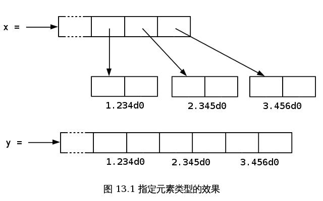

.. highlight:: cl

第十三章：速度
**************************************************

Lisp 實際上是兩種語言：一種能寫出快速執行的程式，一種則能讓你快速的寫出程式。
在程式開發的早期階段，你可以爲了開發上的便捷捨棄程式的執行速度。一旦程式的結構開始固化，你就可以精煉其中的關鍵部分以使得它們執行的更快。

由於各個 Common Lisp 實現間的差異，很難針對優化給出通用的建議。在一個實現上使程式變快的修改也許在另一個實現上會使得程式變慢。這是難免的事兒。越強大的語言，離機器底層就越遠，離機器底層越遠，語言的不同實現沿著不同路徑趨向它的可能性就越大。因此，即便有一些技巧幾乎一定能夠讓程式運行的更快，本章的目的也只是建議而不是規定。

13.1 瓶頸規則 (The Bottleneck Rule)
=======================================

不管是什麼實現，關於優化都可以整理出三點規則：它應該關注瓶頸，它不應該開始的太早，它應該始於算法。

也許關於優化最重要的事情就是要意識到，程式中的大部分執行時間都是被少數瓶頸所消耗掉的。
正如\ 高德納_\ 所說，“在一個與 I/O 無關 (Non-I/O bound) 的程式中，大部分的運行時間集中在大概 3% 的原始碼中。” `λ <http://acl.readthedocs.org/en/latest/zhTW/notes.html#notes-213>`_ 優化程式的這一部分將會使得它的運行速度明顯的提升；相反，優化程式的其他部分則是在浪費時間。

因此，優化程式時關鍵的第一步就是找到瓶頸。許多 Lisp 實現都提供性能分析器 (profiler) 來監視程式的運行並報告每一部分所花費的時間量。
爲了寫出最爲高效的程式，性能分析器非常重要，甚至是必不可少的。
如果你所使用的 Lisp 實現帶有性能分析器，那麼請在進行優化時使用它。另一方面，如果實現沒有提供性能分析器的話，那麼你就不得不通過猜測來尋找瓶頸，而且這種猜測往往都是錯的！

瓶頸規則的一個推論是，不應該在程式的初期花費太多的精力在優化上。\ 高德納_\ 對此深信不疑：“過早的優化是一切 (至少是大多數) 問題的源頭。” `λ <http://acl.readthedocs.org/en/latest/zhTW/notes.html#notes-214>`_
在剛開始寫程式的時候，通常很難看清真正的瓶頸在哪，如果這個時候進行優化，你很可能是在浪費時間。優化也會使程式的修改變得更加困難，邊寫程式邊優化就像是在用風乾非常快的顏料來畫畫一樣。

在適當的時候做適當的事情，可以讓你寫出更優秀的程式。Lisp 的一個優點就是能讓你用兩種不同的工作方式來進行開發：快速地寫出執行較慢的程式，或者，放慢寫程式的速度，精雕細琢，從而得出執行得較快的程式。

在程式開發的初期階段，工作通常在第一種模式下進行，只有當性能成爲問題的時候，才切換到第二種模式。
對於非常底層的語言，比如彙編，你必須優化程式的每一行。但這麼做會浪費你大部分的精力，因爲瓶頸僅僅是其中很小的那部分程式。一個更加抽象的語言能夠讓你把主要精力集中在瓶頸上， 達到事半功倍的效果。

當真正開始優化的時候，還必須從最頂端入手。
在使用各種低層次的編碼技巧 (low-level coding tricks) 之前，請先確保你已經使用了最爲高效的算法。
這麼做的潛在好處相當大 ── 甚至可能大到你都不再需要玩那些奇淫技巧。
當然本規則還是要和前一個規則保持平衡。
有些時候，關於算法的決策必須儘早進行。

13.2 編譯 (Compilation)
==================================================

有五個參數可以控制程式的編譯方式： *speed* (速度)代表編譯器產生程式碼的速度； *compilation-speed* (編譯速度)代表程式被編譯的速度； *safety* (安全) 代表要對目標程式碼進行錯誤檢查的數量； *space* (空間)代表目標程式碼的大小和記憶體需求量；最後， *debug* (除錯)代表爲了除錯而保留的資訊量。

.. note::

   互動與直譯 (INTERACTIVE VS. INTERPRETED)

   Lisp 是一種互動式語言 (Interactive Language)，但是互動式的語言不必都是直譯型的。早期的 Lisp 都通過直譯器實現，因此認爲 Lisp 的特質都依賴於它是被直譯的想法就這麼產生了。但這種想法是錯誤的：Common Lisp 既是編譯型語言，又是直譯型語言。

   至少有兩種 Common Lisp 實現甚至都不包含直譯器。在這些實現中，輸入到頂層的表達式在求值前會被編譯。因此，把頂層叫做直譯器的這種說法，不僅是落伍的，甚至還是錯誤的。

編譯參數不是真正的變數。它們在宣告中被分配從 ``0`` (最不重要) 到 ``3`` (最重要) 的權值。如果一個主要的瓶頸發生在某個函數的內層迴圈中，我們或許可以添加如下的宣告：

::

  (defun bottleneck (...)
    (do (...)
        (...)
      (do (...)
          (...)
        (declare (optimize (speed 3) (safety 0)))
        ...)))

一般情況下，應該在程式寫完並且經過完善測試之後，才考慮加上那麼一句宣告。

要讓程式在任何情況下都儘可能地快，可以使用如下宣告：

::

  (declaim (optimize (speed 3)
                     (compilation-speed 0)
                     (safety 0)
                     (debug 0)))

考慮到前面提到的瓶頸規則 [1]_ ，這種苛刻的做法可能並沒有什麼必要。

另一種特別重要的優化就是由 Lisp 編譯器完成的尾遞迴優化。當 *speed* (速度)的權值最大時，所有支持尾遞迴優化的編譯器都將保證對程式碼進行這種優化。

如果在一個呼叫返回時呼叫者中沒有殘餘的計算，該呼叫就被稱爲尾遞迴。下面的程式返回列表的長度：

::

  (defun length/r (lst)
    (if (null lst)
        0
        (1+ (length/r (cdr lst)))))

這個遞迴呼叫不是尾遞迴，因爲當它返回以後，它的值必須傳給 ``1+`` 。相反，這是一個尾遞迴的版本，

::

  (defun length/rt (lst)
    (labels ((len (lst acc)
               (if (null lst)
                   acc
                   (len (cdr lst) (1+ acc)))))
      (len lst 0)))

更準確地說，區域函數 ``len`` 是尾遞迴呼叫，因爲當它返回時，呼叫函數已經沒什麼事情可做了。
和 ``length/r`` 不同的是，它不是在遞迴回溯的時候構建返回值，而是在遞迴呼叫的過程中積累返回值。
在函數的最後一次遞迴呼叫結束之後， ``acc`` 參數就可以作爲函數的結果值被返回。

出色的編譯器能夠將一個尾遞迴編譯成一個跳轉 (goto)，因此也能將一個尾遞迴函數編譯成一個迴圈。在典型的機器語言程式碼中，當第一次執行到表示 ``len`` 的指令片段時，棧上會有資訊指示在返回時要做些什麼。由於在遞迴呼叫後沒有殘餘的計算，該資訊對第二層呼叫仍然有效：第二層呼叫返回後我們要做的僅僅就是從第一層呼叫返回。因此，當進行第二層呼叫時，我們只需給參數設置新的值，然後跳轉到函數的起始處繼續執行就可以了，沒有必要進行真正的函數呼叫。

另一個利用函數呼叫抽象，卻又沒有開銷的方法是使函數內聯編譯。對於那些呼叫開銷比函數體的執行代價還高的小型函數來說，這種技術非常有價值。例如，以下程式用來判斷列表是否僅有一個元素：

::

  (declaim (inline single?))

  (defun single? (lst)
    (and (consp lst) (null (cdr lst))))

因爲這個函數是在全局被宣告爲內聯的，引用了 ``single?`` 的函數在編譯後將不需要真正的函數呼叫。 [2]_ 如果我們定義一個呼叫它的函數，

::

  (defun foo (x)
    (single? (bar x)))

當 ``foo`` 被編譯後， ``single?`` 函數體中的程式碼將會被編譯進 ``foo`` 的函數體，就好像我們直接寫了以下的程式一樣：

::

  (defun foo (x)
    (let ((lst (bar x)))
      (and (consp lst) (null (cdr lst)))))

內聯編譯有兩個限制。首先，遞迴函數不能內聯。其次，如果一個內聯函數被重新定義，我們就必須重新編譯呼叫它的任何函數，否則呼叫仍然使用原來的定義。

在一些早期的 Lisp 方言中，有時候會使用宏（ 10.2 節）來避免函數呼叫。這種做法在 Common Lisp 中通常是沒有必要的。

不同 Lisp 編譯器的優化方式千差萬別。如果你想了解你的編譯器爲某個函數生成的程式碼，試著呼叫 ``disassemble`` 函數：它接受一個函數或者函數名，並顯示該函數編譯後的形式。即便你看到的東西是完全無法理解的，你仍然可以使用 ``disassemble`` 來判斷宣告是否起效果：編譯函數的兩個版本，一個使用優化宣告，另一個不使用優化宣告，然後觀察由 ``disassemble`` 顯示的兩組程式之間是否有差異。同樣的技巧也可以用於檢驗函數是否被內聯編譯。不論情況如何，都請優先考慮使用編譯參數，而不是手動調優的方式來優化程式。

13.3 型別宣告 (Type Declarations)
========================================

如果 Lisp 不是你所學的第一門編程語言，那麼你也許會感到困惑，爲什麼這本書還沒說到型別宣告這件事來？畢竟，在很多流行的編程語言中，型別宣告是必須要做的。

在多數編程語言裡，你必須爲每個變數宣告型別，並且變數也只可以持有與該型別相一致的值。這種語言被稱爲\ *強型別*\ (\ *strongly typed*\ ) 語言。除了給程式設計師們徒增了許多負擔外，這種方式還限制了你能做的事情。使用這種語言，很難寫出那些需要多種型別的參數一起工作的函數，也很難定義出可以包含不同種類元素的資料結構。當然，這種方式也有它的優勢，比如無論何時當編譯器碰到一個加法運算，它都能夠事先知道這是一個什麼型別的加法運算。如果兩個參數都是整數型別，編譯器可以直接在目標程式碼中生成一個固定 (hard-wire) 的整數加法運算。

正如 2.15 節所講，Common Lisp 使用一種更加靈活的方式：顯式型別 (manifest typing) [3]_ 。有型別的是值而不是變數。變數可以用於任何型別的物件。

當然，這種靈活性需要付出一定的速度作爲代價。由於 ``+`` 可以接受好幾種不同型別的數，它不得不在運行時查看每個參數的型別來決定採用哪種加法運算。

在某些時候，如果我們要執行的全都是整數的加法，那麼每次查看參數型別的這種做法就說不上高效了。Common Lisp 處理這種問題的方法是：讓程式設計師儘可能地提示編譯器。比如說，如果我們提前就能知道某個加法運算的兩個參數是定長數 (fixnums) ，那麼就可以對此進行宣告，這樣編譯器就會像 C 語言的那樣爲我們生成一個固定的整數加法運算。

因爲顯式型別也可以通過宣告型別來生成高效的程式碼，所以強型別和顯式型別兩種方式之間的差別並不在於運行速度。真正的區別是，在強型別語言中，型別宣告是強制性的，而顯式型別則不強加這樣的要求。
在 Common Lisp 中，型別宣告完全是可選的。它們可以讓程式運行的更快，但(除非錯誤)不會改變程式的行爲。

全局宣告以 ``declaim`` 伴隨一個或多個宣告的形式來實現。
一個型別宣告是一個列表，包含了符號 ``type`` ，後跟一個型別名，以及一個或多個變數組成。舉個例子，要爲一個全局變數宣告型別，可以這麼寫：

::

  (declaim (type fixnum *count*))

在 ANSI Common Lisp 中，可以省略 ``type`` 符號，將宣告簡寫爲：

::

  (declaim (fixnum *count*))

區域宣告通過 ``declare`` 完成，它接受的參數和 ``declaim`` 的一樣。宣告可以放在那些創建變數的
程式碼體之前：如 ``defun`` 、 ``lambda`` 、 ``let`` 、 ``do`` ，諸如此類。比如說，要把一個函數的參數宣告爲定長數，可以這麼寫：

::

  (defun poly (a b x)
    (declare (fixnum a b x))
    (+ (* a (expt x 2)) (* b x)))

在型別宣告中的變數名指的就是該宣告所在的上下文中的那個變數 ── 那個通過賦值可以改變它的值的變數。

你也可以通過 ``the`` 爲某個表達式的值宣告型別。如果我們提前就知道 ``a`` 、 ``b`` 和 ``x`` 是足夠小的定長數，並且它們的和也是定長數的話，那麼可以進行以下宣告：

::

  (defun poly (a b x)
    (declare (fixnum a b x))
    (the fixnum (+ (the fixnum (* a (the fixnum (expt x 2))))
                   (the fixnum (* b x)))))

看起來是不是很笨拙啊？幸運的是有兩個原因讓你很少會這樣使用 ``the`` 把你的數值運算程式碼變得散亂不堪。其一是很容易通過宏，來幫你插入這些宣告。其二是某些實現使用了特殊的技巧，即便沒有型別宣告的定長數運算也能足夠快。

Common Lisp 中有相當多的型別 ── 恐怕有無數種型別那麼多，如果考慮到你可以自己定義新的型別的話。
型別宣告只在少數情況下至關重要，可以遵照以下兩條規則來進行：

1. 當函數可以接受若干不同型別的參數(但不是所有型別)時，可以對參數的型別進行宣告。如果你知道一個對 ``+`` 的呼叫總是接受定長數型別的參數，或者一個對 ``aref`` 的呼叫第一個參數總是某種特定種類的陣列，那麼進行型別宣告是值得的。

2. 通常來說，只有對型別層級中接近底層的型別進行宣告，才是值得的：將某個東西的型別宣告爲 ``fixnum`` 或者 ``simple-array`` 也許有用，但將某個東西的型別宣告爲 ``integer`` 或者 ``sequence`` 或許就沒用了。

型別宣告對內容複雜的物件特別重要，這包括陣列、結構和物件實體。這些宣告可以在兩個方面提升效率：除了可以讓編譯器來決定函數參數的型別以外，它們也使得這些物件可以在記憶體中更高效地表示。

如果對陣列元素的型別一無所知的話，這些元素在記憶體中就不得不用一塊指標來表示。但假如預先就知道陣列包含的元素僅僅是 ── 比方說 ── 雙精度浮點數 (double-floats)，那麼這個陣列就可以用一組實際的雙精度浮點數來表示。這樣陣列將佔用更少的空間，因爲我們不再需要額外的指標指向每一個雙精度浮點數；同時，對陣列元素的存取也將更快，因爲我們不必沿著指標去讀取和寫元素。

**圖 13.1：指定元素型別的效果**

你可以通過 ``make-array`` 的 ``:element-type`` 參數指定陣列包含值的種類。這樣的陣列被稱爲\ *特化陣列*\ (specialized array)。圖 13.1 爲我們示範了如下程式碼在多數實現上求值後發生的事情：

::

   (setf x (vector 1.234d0 2.345d0 3.456d0)
         y (make-array 3 :element-type 'double-float)
         (aref y 0) 1.234d0
         (aref y 1) 2.345d0
         (aref y 2）3.456d0))

圖 13.1 中的每一個矩形方格代表記憶體中的一個字 (a word of memory)。這兩個陣列都由未特別指明長度的頭部 (header) 以及後續三個元素的某種表示構成。對於 ``x`` 來說，每個元素都由一個指標表示。此時每個指標碰巧都指向雙精度浮點數，但實際上我們可以存儲任何型別的物件到這個向量中。對 ``y`` 來說，每個元素實際上都是雙精度浮點數。 ``y`` 更快而且佔用更少空間，但意味著它的元素只能是雙精度浮點數。

注意我們使用 ``aref`` 來引用 ``y`` 的元素。一個特化的向量不再是一個簡單向量，因此我們不再能夠通過 ``svref`` 來引用它的元素。

除了在創建陣列時指定元素的型別，你還應該在使用陣列的程式碼中，宣告陣列的維度以及它的元素型別。一個完整的向量宣告如下：

::

  (declare (type (vector fixnum 20) v))

以上程式碼宣告了一個僅含有定長數，並且長度固定爲 ``20`` 的向量。

::

  (setf a (make-array '(1000 1000)
                      :element-type 'single-float
                      :initial-element 1.0s0))

  (defun sum-elts (a)
    (declare (type (simple-array single-float (1000 1000))
                   a))
    (let ((sum 0.0s0))
      (declare (type single-float sum))
      (dotimes (r 1000)
        (dotimes (c 1000)
          (incf sum (aref a r c))))
      sum))

**圖 13.2 對陣列元素求和**

最爲通用的陣列宣告形式由陣列型別以及緊接其後的元素型別和一個維度列表構成：

::

  (declare (type (simple-array fixnum (4 4)) ar))

圖 13.2 示範了如何創建一個 1000×1000 的單精度浮點數陣列，以及如何編寫一個將該陣列元素相加的函數。陣列以列主序 (row-major order)存儲，遍歷時也應儘可能以此序進行。

我們將用 ``time`` 來比較 ``sum-elts`` 在有宣告和無宣告兩種情況下的性能。 ``time`` 宏顯示表達式求值所花費時間的某種度量(取決於實現)。對被編譯的函數求取時間才是有意義的。在某個實現中，如果我們以獲取最快速

程式碼的編譯參數編譯 ``sum-elts`` ，它將在不到半秒的時間內返回：

::

  > (time (sum-elts a))
  User Run Time = 0.43 seconds
  1000000.0

如果我們把 *sum-elts* 中的型別宣告去掉並重新編譯它，同樣的計算將花費超過5秒的時間：

::

  > (time (sum-elts a))
  User Run Time = 5.17 seconds
  1000000.0

型別宣告的重要性 ── 特別是對陣列和數來說 ── 怎麼強調都不過分。上面的例子中，僅僅兩行程式碼，就可以讓 ``sum-elts`` 變快 12 倍。

13.4 避免垃圾 (Garbage Avoidance)
===================================================

Lisp 除了可以讓你推遲考慮變數的型別以外，它還允許你推遲對記憶體分配的考慮。在程式的早期階段，暫時忽略記憶體分配和臭蟲等問題，將有助於解放你的想象力。等到程式基本固定下來以後，就可以開始考慮怎麼減少動態分配，從而讓程式運行得更快。

但是，並不是構造（consing）用得少的程式就一定快。多數 Lisp 實現一直使用著差勁的垃圾回收器，在這些實現中，過多的記憶體分配容易讓程式運行變得緩慢。因此，『高效的程式應該儘可能地減少 ``cons`` 的使用』這種觀點，逐漸成爲了一種傳統。最近這種傳統開始有所改變，因爲一些實現已經用上了相當先進（sophisticated）的垃圾回收器，它們實行一種更爲高效的策略：創建新的物件，用完之後拋棄而不是進行回收。

本節介紹了幾種方法，用於減少程式中的構造。但構造數量的減少是否有利於加快程式的運行，這一點最終還是取決於實現。最好的辦法就是自己去試一試。

減少構造的辦法有很多種。有些辦法對程式的修改非常少。
例如，最簡單的方法就是使用破壞性函數。下表羅列了一些常用的函數，以及這些函數對應的破壞性版本。

+-------------------+-------------------+
|      安全         |   破壞性          |
+===================+===================+
| append            | nconc             |
+-------------------+-------------------+
| reverse           | nreverse          |
+-------------------+-------------------+
| remove            | delete            |
+-------------------+-------------------+
| remove-if         | delete-if         |
+-------------------+-------------------+
| remove-duplicates | delete-duplicates |
+-------------------+-------------------+
| subst             | nsubst            |
+-------------------+-------------------+
| subst-if          | nsubst-if         |
+-------------------+-------------------+
| union             | nunion            |
+-------------------+-------------------+
| intersection      | nintersection     |
+-------------------+-------------------+
| set-difference    | nset-difference   |
+-------------------+-------------------+

當確認修改列表是安全的時候，可以使用 ``delete`` 替換 ``remove`` ，用 ``nreverse`` 替換 ``reverse`` ，諸如此類。

即便你想完全擺脫構造，你也不必放棄在執行時創建物件的可能性。你需要做的是避免在運行中爲它們分配空間和通過垃圾回收收回空間。通用方案是你自己預先分配記憶體塊 (block of memory)，以及明確回收用過的塊。\ *預先*\ 可能意味著在編譯期或者某些初始化例程中。具體情況還應具體分析。

例如，當情況允許我們利用一個有限大小的堆棧時，我們可以讓堆棧在一個已經分配了空間的向量中增長或縮減，而不是構造它。Common Lisp 內建支持把向量作爲堆棧使用。如果我們傳給 ``make-array`` 可選的 ``fill-pointer`` 參數，我們將得到一個看起來可擴展的向量。 ``make-array`` 的第一個參數指定了分配給向量的存儲量，而 ``fill-pointer`` 指定了初始有效長度：

::

  > (setf *print-array* t)
  T
  > (setf vec (make-array 10 :fill-pointer 2
                             :initial-element nil))
  #(NIL NIL)

我們剛剛創建的向量對於操作序列的函數來說，仍好像只含有兩個元素，

::

  > (length vec)
  2

但它能夠增長直到十個元素。因爲 ``vec`` 有一個填充指標，我們可以使用 ``vector-push`` 和 ``vector-pop`` 函數推入和彈出元素，就像它是一個列表一樣：

::

  > (vector-push 'a vec)
  2
  > vec
  #(NIL NIL A)
  > (vector-pop vec)
  A
  > vec
  #(NIL NIL)

當我們呼叫 ``vector-push`` 時，它增加填充指標並返回它過去的值。只要填充指標小於 ``make-array`` 的第一個參數，我們就可以向這個向量中推入新元素；當空間用盡時， ``vector-push`` 返回 ``nil`` 。目前我們還可以向 ``vec`` 中推入八個元素。

使用帶有填充指標的向量有一個缺點，就是它們不再是簡單向量了。我們不得不使用 ``aref`` 來代替 ``svref`` 引用元素。代價需要和潛在的收益保持平衡。

::

  (defconstant dict (make-array 25000 :fill-pointer 0))

  (defun read-words (from)
    (setf (fill-pointer dict) 0)
    (with-open-file (in from :direction :input)
      (do ((w (read-line in nil :eof)
              (read-line in nil :eof)))
          ((eql w :eof))
        (vector-push w dict))))

  (defun xform (fn seq) (map-into seq fn seq))

  (defun write-words (to)
    (with-open-file (out to :direction :output
                            :if-exists :supersede)
      (map nil #'(lambda (x)
                   (fresh-line out)
                   (princ x out))
               (xform #'nreverse
                      (sort (xform #'nreverse dict)
                            #'string<)))))

**圖 13.3 生成同韻字辭典**

當應用涉及很長的序列時，你可以用 ``map-into`` 代替 ``map`` 。 ``map-into`` 的第一個參數不是一個序列型別，而是用來存儲結果的，實際的序列。這個序列可以是該函數接受的其他序列參數中的任何一個。所以，打個比方，如果你想爲一個向量的每個元素加 1，你可以這麼寫：

::

  (setf v (map-into v #'1+ v))

圖 13.3 展示了一個使用大向量應用的例子：一個生成簡單的同韻字辭典 (或者更確切的說，一個不完全韻辭典)的程式。函數 ``read-line`` 從一個每行僅含有一個單詞的檔案中讀取單詞，而函數 ``write-words`` 將它們按照字母的逆序打印出來。比如，輸出的起始可能是

::

  a amoeba alba samba marimba...

結束是

::

  ...megahertz gigahertz jazz buzz fuzz

利用填充指標和 ``map-into`` ，我們可以把程式寫的既簡單又高效。

在數值應用中要當心大數 (bignums)。大數運算需要構造，因此也就會比較慢。即使程式的最後結果爲大數，但是，通過調整計算，將中間結果保存在定長數中，這種優化也是有可能的。

另一個避免垃圾回收的方法是，鼓勵編譯器在棧上分配物件而不是在堆上。如果你知道只是臨時需要某個東西，你可以通過將它宣告爲 ``dynamic extent`` 來避免在堆上分配空間。

通過一個動態範圍 (dynamic extent)變數宣告，你告訴編譯器，變數的值應該和變數保持相同的生命期。
什麼時候值的生命期比變數長呢？這裡有個例子：

::

  (defun our-reverse (lst)
    (let ((rev nil))
      (dolist (x lst)
        (push x rev))
      rev))

在 ``our-reverse`` 中，作爲參數傳入的列表以逆序被收集到 ``rev`` 中。當函數返回時，變數 ``rev`` 將不復存在。然而，它的值 ── 一個逆序的列表 ── 將繼續存活：它被送回呼叫函數，一個知道它的命運何去何從的地方。

相比之下，考慮如下 ``adjoin`` 實現：

::

  (defun our-adjoin (obj lst &rest args)
    (if (apply #'member obj lst args)
        lst
        (cons obj lst)))

在這個例子裡，我們可以從函數的定義看出， ``args`` 參數中的值 (列表) 哪兒也沒去。它不必比存儲它的變數活的更久。在這種情形下把它宣告爲動態範圍的就比較有意義。如果我們加上這樣的宣告：

::

  (defun our-adjoin (obj lst &rest args)
    (declare (dynamic-extent args))
    (if (apply #'member obj lst args)
        lst
        (cons obj lst)))

那麼編譯器就可以 (但不是必須)在棧上爲 ``args`` 分配空間，在 ``our-adjoin`` 返回後，它將自動被釋放。

13.5 範例: 存儲池 (Example: Pools)
==========================================

對於涉及資料結構的應用，你可以通過在一個存儲池 (pool)中預先分配一定數量的結構來避免動態分配。當你需要一個結構時，你從池中取得一份，當你用完後，再把它送回池中。爲了示範存儲池的使用，我們將快速的編寫一段記錄港口中船舶數量的程式原型 (prototype of a program)，然後用存儲池的方式重寫它。

::

  (defparameter *harbor* nil)

  (defstruct ship
    name flag tons)

  (defun enter (n f d)
    (push (make-ship :name n :flag f :tons d)
          *harbor*))

  (defun find-ship (n)
    (find n *harbor* :key #'ship-name))

  (defun leave (n)
    (setf *harbor*
          (delete (find-ship n) *harbor*)))

**圖 13.4 港口**

圖 13.4 中展示的是第一個版本。 全局變數 ``harbor`` 是一個船隻的列表， 每一艘船隻由一個 ``ship`` 結構表示。 函數 ``enter``
在船只進入港口時被呼叫； ``find-ship`` 根據給定名字 (如果有的話) 來尋找對應的船隻；最後， ``leave`` 在船隻離開港口時被呼叫。

一個程式的初始版本這麼寫簡直是棒呆了，但它會產生許多的垃圾。當這個程式運行時，它會在兩個方面構造：當船只進入港口時，新的結構將會被分配；而 ``harbor`` 的每一次增大都需要使用構造。

我們可以通過在編譯期分配空間來消除這兩種構造的源頭 (sources of consing)。圖 13.5 展示了程式的第二個版本，它根本不會構造。

::

  (defconstant pool (make-array 1000 :fill-pointer t))

  (dotimes (i 1000)
    (setf (aref pool i) (make-ship)))

  (defconstant harbor (make-hash-table :size 1100
                                       :test #'eq))

  (defun enter (n f d)
    (let ((s (if (plusp (length pool))
                 (vector-pop pool)
                 (make-ship))))
      (setf (ship-name s)        n
            (ship-flag s)        f
            (ship-tons s)        d
            (gethash n harbor) s)))

  (defun find-ship (n) (gethash n harbor))

  (defun leave (n)
    (let ((s (gethash n harbor)))
      (remhash n harbor)
      (vector-push s pool)))

**圖 13.5 港口（第二版）**

嚴格說來，新的版本仍然會構造，只是不在運行期。在第二個版本中， ``harbor`` 從列表變成了雜湊表，所以它所有的空間都在編譯期分配了。一千個 ``ship`` 結構體也會在編譯期被創建出來，並被保存在向量池(vector pool) 中。(如果 ``:fill-pointer`` 參數爲 ``t`` ，填充指標將指向向量的末尾。) 此時，當 ``enter`` 需要一個新的結構時，它只需從池中取來一個便是，無須再呼叫 ``make-ship`` 。
而且當 ``leave`` 從 ``harbor`` 中移除一艘 ``ship`` 時，它把它送回池中，而不是拋棄它。

我們使用存儲池的行爲實際上是肩負起記憶體管理的工作。這是否會讓我們的程式更快仍取決於我們的 Lisp 實現怎樣管理記憶體。總的說來，只有在那些仍使用著原始垃圾回收器的實現中，或者在那些對 GC 的不可預見性比較敏感的實時應用中才值得一試。

13.6 快速運算子 (Fast Operators)
=======================================

本章一開始就宣稱 Lisp 是兩種不同的語言。就某種意義來講這確實是正確的。如果你仔細看過 Common Lisp 的設計，你會發現某些特性主要是爲了速度，而另外一些主要爲了便捷性。

例如，你可以通過三個不同的函數取得向量給定位置上的元素： ``elt`` 、 ``aref`` 、 ``svref`` 。如此的多樣性允許你把一個程式的性能提升到極致。 所以如果你可以使用 ``svref`` ，完事兒！ 相反，如果對某段程式來說速度很重要的話，或許不應該呼叫 ``elt`` ，它既可以用於陣列也可以用於列表。

對於列表來說，你應該呼叫 ``nth`` ，而不是 ``elt`` 。然而只有單一的一個函數 ── ``length`` ── 用於計算任何一個序列的長度。爲什麼 Common Lisp 不單獨爲列表提供一個特定的版本呢？因爲如果你的程式正在計算一個列表的長度，它在速度上已經輸了。在這個例子中，就像許多其他的例子一樣，語言的設計暗示了哪些會是快速的而哪些不是。

另一對相似的函數是 ``eql`` 和 ``eq`` 。前者是驗證同一性 (identity) 的默認判斷式，但如果你知道參數不會是字元或者數字時，使用後者其實更快。兩個物件 *eq* 只有當它們處在相同的記憶體位置上時才成立。數字和字元可能不會與任何特定的記憶體位置相關，因此 ``eq`` 不適用於它們 (即便多數實現中它仍然能用於定長數)。對於其他任何種類的參數， ``eq`` 和 ``eql`` 將返回相同的值。

使用 ``eq`` 來比較物件總是最快的，因爲 Lisp 所需要比較的僅僅是指向物件的指標。因此 ``eq`` 雜湊表 (如圖 13.5 所示) 應該會提供最快的存取。 在一個 ``eq`` 雜湊表中， ``gethash`` 可以只根據指標查找，甚至不需要查看它們指向的是什麼。然而，存取不是唯一要考慮的因素； *eq* 和 *eql* 雜湊表在拷貝型垃圾回收算法 (copying garbage collection algorithm)中會引起額外的開銷，因爲垃圾回收後需要對一些哈希值重新進行計算 (rehashing)。如果這變成了一個問題，最好的解決方案是使用一個把定長數作爲鍵值的 ``eql`` 雜湊表。

當被調函數有一個剩餘參數時，呼叫 ``reduce`` 可能是比 ``apply`` 更高效的一種方式。例如，相比

::

(apply #'+ '(1 2 3))

寫成如下可以更高效：

::

(reduce #'+ '(1 2 3))

它不僅有助於呼叫正確的函數，還有助於按照正確的方式呼叫它們。餘留、可選和關鍵字參數
是昂貴的。只使用普通參數，函數呼叫中的參量會被呼叫者簡單的留在被調者能夠找到的地方。但其他種類的參數涉及運行時的處理。關鍵字參數是最差的。針對內建函數，優秀的編譯器採用特殊的辦法把使用關鍵字參量的呼叫編譯成快速程式碼 (fast code)。但對於你自己編寫的函數，避免在程式中對速度敏感的部分使用它們只有好處沒有壞處。另外，不把大量的參量都放到餘留參數中也是明智的舉措，如果這可以避免的話。

不同的編譯器有時也會有一些它們獨門優化。例如，有些編譯器可以針對鍵值是一個狹小範圍中的整數的 ``case`` 語句進行優化。查看你的用戶手冊來了解那些實現特有的優化的建議吧。

13.7 二階段開發 (Two-Phase Development)
==================================================

在以速度至上的應用中，你也許想要使用諸如 C 或者彙編這樣的低級語言來重寫一個 Lisp 程式的某部分。你可以對用任何語言編寫的程式使用這一技巧 ── C 程式的關鍵部分經常用彙編重寫 ── 但語言越抽象，用兩階段（two phases）開發程式的好處就越明顯。

Common Lisp 沒有規定如何集成其他語言所編寫的程式碼。這部分留給了實現決定，而幾乎所有的實現都提供了某種方式來實現它。

使用一種語言編寫程式然後用另一種語言重寫它其中部分看起來可能是一種浪費。事實上，經驗顯示這是一種好的開發軟體的方式。先針對功能、然後是速度比試著同時達成兩者來的簡單。

如果編程完全是一個機械的過程 ── 簡單的把規格說明翻譯爲程式碼 ── 在一步中把所有的事情都搞定也許是合理的。但編程永遠不是如此。不論規格說明多麼精確， 編程總是涉及一定量的探索 ── 通常比任何人能預期到的還多的多。

一份好的規格說明，也許會讓編程看起來像是簡單的把它們翻譯成程式碼的過程。這是一個普遍的誤區。編程必定涉及探索，因爲規格說明必定含糊不清。如果它們不含糊的話，它們就都算不上規格說明。

在其他領域，儘可能精準的規格說明也許是可取的。如果你要求一塊金屬被切割成某種形狀，最好準確的說出你想要的。但這個規則不適用於軟體，因爲程式和規格說明由相同的東西構成：文字。你不可能編寫出完全合意的規格說明。如果規格說明有那麼精確的話，它們就變成程式了。 `λ <http://acl.readthedocs.org/en/latest/zhTW/notes.html#notes-229>`_

對於存在著可觀數量的探索的應用（再一次，比任何人承認的還要多，將實現分成兩個階段是值得的。而且在第一階段中你所使用的手段 (medium）不必就是最後的那個。例如，製作銅像的標準方法是先從粘土開始。你先用粘土做一個塑像出來，然後用它做一個模子，在這個模子中鑄造銅像。在最後的塑像中是沒有丁點粘土的，但你可以從銅像的形狀中認識到它發揮的作用。試想下從一開始就只用一塊兒銅和一個鑿子來製造這麼個一模一樣的塑像要多難啊！出於相同的原因，首先用 Lisp 來編寫程式，然後用 C 改寫它，要比從頭開始就用 C 編寫這個程式要好。

Chapter 13 總結 (Summary)
============================

1. 不應過早開始優化，應該關注瓶頸，而且應該從算法開始。

2. 有五個不同的參數控制編譯。它們可以在本地宣告也可以在全局宣告。

3. 優秀的編譯器能夠優化尾遞迴，將一個尾遞迴的函數轉換爲一個迴圈。內聯編譯是另一種避免函數呼叫的方法。

4. 型別宣告並不是必須的，但它們可以讓一個程式更高效。型別宣告對於處理數值和陣列的程式碼特別重要。

5. 少的構造可以讓程式更快，特別是在使用著原始的垃圾回收器的實現中。解決方案是使用破壞性函數、預先分配空間塊、以及在棧上分配。

6. 某些情況下，從預先分配的存儲池中提取物件可能是有價值的。

7. Common Lisp 的某些部分是爲了速度而設計的，另一些則爲了靈活性。

8. 編程必定存在探索的過程。探索和優化應該被分開 ── 有時甚至需要使用不同的語言。

Chapter 13 練習 (Exercises)
==================================

1. 檢驗你的編譯器是否支持 (observe)內斂宣告。

2. 將下述函數重寫爲尾遞迴形式。它被編譯後能快多少？

::

  (defun foo (x)
    (if (zerop x)
        0
        (1+ (foo (1- x)))))

  注意：你需要增加額外的參數。

3. 爲下述程式增加宣告。你能讓它們變快多少？

::

  (a) 在 5.7 節中的日期運算程式碼。
  (b) 在 9.8 節中的光線跟蹤器 (ray-tracer)。

4. 重寫 3.15 節中的廣度優先搜索的程式，讓它儘可能減少使用構造。

5. 使用存儲池修改 4.7 節中的二元搜索的程式碼。

.. _高德納 : http://en.wikipedia.org/wiki/Donald_Knuth

.. rubric:: 腳註

.. [1] 較早的實現或許不提供 ``declaim`` ；需要使用 ``proclaim`` 並且引用這些參量 (quote the argument)。

.. [2] 爲了讓內聯宣告 (inline declaration) 有效，你同時必須設置編譯參數，告訴它你想獲得最快的程式碼。

.. [3] 有兩種方法可以描述 Lisp 宣告型別 (typing) 的方式：從型別資訊被存放的位置或者從它被使用的時間。顯示型別 (manifest typing) 的意思是型別資訊與資料物件 (data objects) 綁定，而運行時型別(run-time typing) 的意思是型別資訊在運行時被使用。實際上，兩者是一回事兒。
